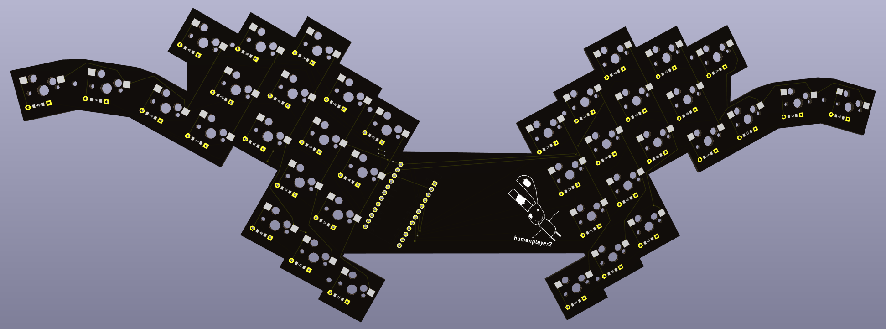
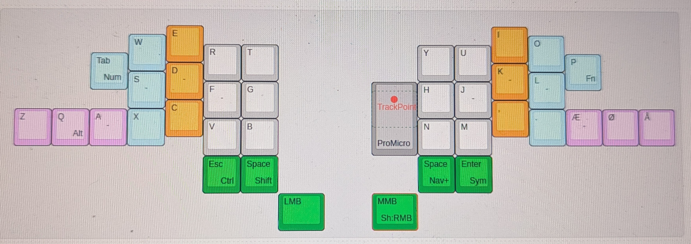

# laserraven
*Laser Corvus Corax. Designed with *

**A 32+6 trackpoint columnar unibody split designed with nordic languages in mind.**

- Lasers are hot. I'm laser cutting the case.
- Ravens are black, like ThinkPads, that have trackpoints.
- Ravens aren't the smallest of birds.
- Ravens are smart tool users. I bet they love lasers. And trackpoints.

## TODO:
- Add gerber files used for production.
- Add note that outlines needed to be closed manually.

## Trackpoint
I really like ThinkPads (X301, you hold my heart). Not least for their trackpoints. I love trackpoints. For my day-to-day computing, I need no other pointing device.

## 32 alpha keys
As a Dane writing frequent Danish and English, on my main layer, I want a 29 letter alphabet (ABC...WXYZ+ÆØÅ). I also want dot and comma. That's 31 keys. For symmetry, that makes 32 keys. Tab, you're in.

## Pinky fans
I like a somewhat aggresive pinky stagger of 1u. I don't find it nice to reach further down than that, so I have no pinky keys under the home row.

Reaching straight up with my pinky is not something I enjoy. On my [Laser Prosthetic](../LaserProsthetic/README.md), I have pinky clusters where I reach up and out a bit. That's fine, but requires a bit of a hand lift.

With the outer-most key on this board, I'm experimenting with how it'll feel to reach only outwards. The pinky fan has a radius the length of my pinky.

## Outer ring
To reach the 32 alpha keys, I need two extra keys somewhere -- else.thank pinkies!

I could add them on the far inside, and reach in with my left index. I'm not using those keys much on my Laser Prothetic.

I've taken a page from the book of my 100 wpm collegue, who types without pinkies. They use the ring fingers for those pinky keys instead. Given the 1u staggered pinky fans, there's ample space for an outer ring finger key.

*KLE sketch of keys for DK Qwerty. Dash (-) marks home row keys.*

## Thumb keys, mouse buttons and layers
I've added 6 thumb keys because this is the maximum amount I find nice to reach.

Two thumb keys are for the trackpoint: One for left click (and dragging), one middle click (and scrolling). Right click is Shift + middle click.

I use six layers: Shift, Ctrl, Alt, Navigation, Numbers and Symbols. Four are on thumb keys, while the two least used are on pinkies (Alt and Numbers).

## Ergogen & KiCad
I have followed . I use  through the command line, on Fedora. Install by `sudo npm -g i ergogen`. From the board's `ergogen` directory, run `ergogen config.yaml`. From there, traces have to be drawn manually in Kicad.

I followed  to add a graphics silkscreen in KiCad.

I forgot to include my Ergogen screw holes before routing. I imported the Ergogen-generated outline of them, positioned them manually referring to an untraced copy that included them, and added them to the Edge.Cuts layer.

## Competents

### PCB
 I made a quick comparison of JLCPCB and PCBWay, and the former gave me a far lower rate. I ordered the minimum of 5 PCBs, FR-4, 1.6mm, LeadFree HASL.
 - `36.83 Euro`  with the cheapest 10-14 days shipping, taxes, and a new customer coupon.

### Trackpoint and controller
 kit, incl. black opaque shield, custom low headers and 
    - `112 USD` for 2, free shipping, taxes not included.

### Soldered components
- 38 Kaihl hotswap sockets. `3.62 USD` for 40.
- W1 1N4148 SOD-123 diodes, 38 pieces. `2.53 USD` for 100.

### Case
It's difficult to find 1,5 mm black acrylic for laser cutting. The companies I've reached out to can't get it.

I've received a sample of nice, black 1.5mm PE-HD, but one company said that it's no good for laser cutting, as it bubbles up. I'll try. It's big enough for a two-piece plate.

I think I'll cut, paste and paint the clear acrylic I already have.
