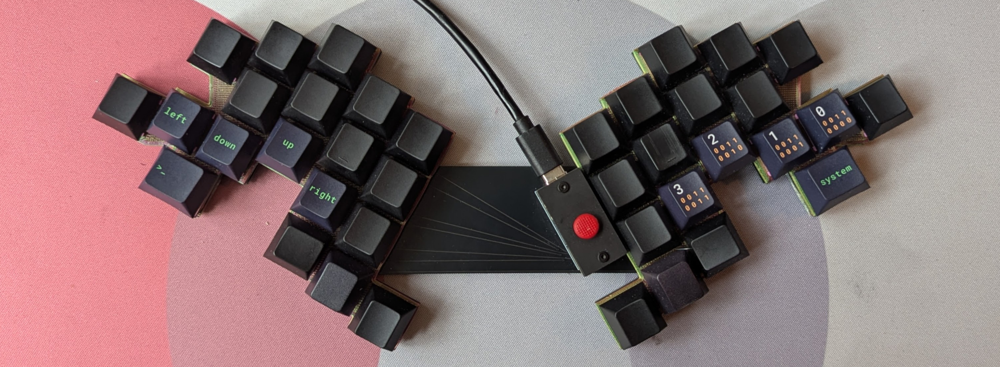
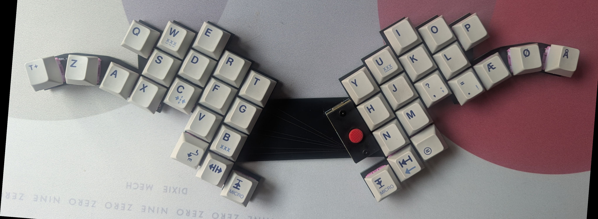
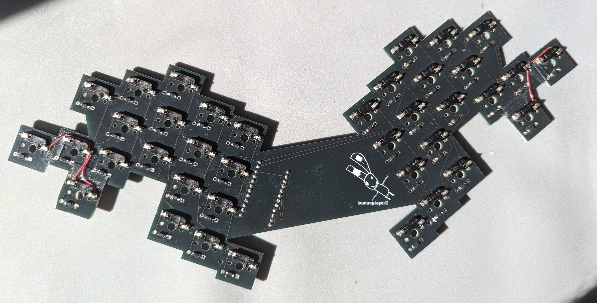

# LaserRaven 38TP

> **A 32+6 trackpoint columnar aggressive stagger unibody split designed with nordic languages in mind.**

- Designed with [Ergogen](https://github.com/ergogen/ergogen)

*Revision 1 (wip). Pinkie fans moved inwards, no splay.*
Left little fingers controls the left-most key + `left` + `>_`, the right the right-most key, `0`, and `system`.

*Version 1: Far, splayed pinky fans*

*Next steps:*
- V2: Ergogen+KiCad a PCB, design case.
- Document change from V1 to Rev. 1.
- V1: Add note that outlines needed to be closed manually in KiCad.

## Keymap
- [My QMK fork](https://github.com/humanplayer2/qmk_firmware) contains firmware, in the `humanplayer2` branch, under `keyboards/humanplayer2/laserraven/`.

*KLE sketch of keys for DK Qwerty. Dash (-) marks home row keys.*

# Build Rationale

- Ravens are black, like ThinkPads, that have trackpoints.
- Ravens are smart tool users. They should love lasers---and trackpoints.
- Lasers are hot. I thought I'd laser cut the case. Now I have a 3D printer...

## Trackpoint
I really like ThinkPads (X301). Not least for their trackpoints. I love trackpoints. For my day-to-day computing, I need no other pointing device.

## 32 alpha keys
As a Dane writing frequent Danish and English, on my main layer, I want a 29 letter alphabet (ABC...WXYZ+ÆØÅ). I also want dot and comma. That's 31 keys. For symmetry, that makes 32 keys. Tab, you're in.

## Lillefinger keys
- Version 1: I haven't enjoyed hitting keys right under the pinky home key, so I experimented with outwards, horizontal pinky fans with radius the length of my pinky. There was a lot of reach involved. Not super nice.
- Revision 1: I took measure of where curling my lillefingers would land it, which is half between the ring and pinky columns. So now I'm trying with a switch there. I use 1.25u keycaps for now, to get a more precise feeling of where I want to place the switch for ver. 2.

## Outer ring
With 6 index, 3 middle, 3 ring, and 3 pinky keys, I need two extra keys somewhere to reach 32.

I could add them on the far inside, like on Corne 4.1, and reach in with my left index. I have tried that on my Laser Prosthetic.

Instead, I've taken a page from the book of my 100 US wpm collegue, who types without pinkies. They use the ring fingers for those pinky keys instead. Given the 1u staggered pinky fans, there's ample space for an outer ring finger key.

## Thumb keys, mouse buttons and layers
6 thumb keys are sufficient for my needs: Esc+Ctrl, Space+Shift, Mouse Button 1+Num/Func, Mouse Button 3 + Trackpoint Scroll, Space+Nav, Enter+Sym. Mouse right click is Shift + Mouse Button 3.

# Build

### Revision 1
- I cut in a v1 PCB, glued the pieces back on, handwired things up.

### Version 1 Design
- I followed [FlatFootFox's eminent guide to Ergogen](https://flatfootfox.com/ergogen-part1-units-points/). I use  through the command line, on Fedora. Install by `sudo npm -g i ergogen`. From the board's `ergogen` directory, run `ergogen config.yaml`. From there, traces have to be drawn manually in KiCad.
- I followed [these steps](https://forum.kicad.info/t/how-to-add-fancy-graphics-to-your-pcb-tutorial/36138) to add a graphics silkscreen in KiCad.
- I forgot to include my Ergogen screw holes before routing. I imported the Ergogen-generated outline of them, positioned them manually referring to an untraced copy that included them, and added them to the Edge.Cuts layer.
- In KiCad, many of the outlines had to be closed manually in the corners before they defined a closed shape.

### Ordering PCB
- I made a quick comparison of JLCPCB and PCBWay, and the former gave me a far lower rate. I ordered the minimum of 5 PCBs, FR-4, 1.6mm, LeadFree HASL.
    - `36.83 Euro`  with the cheapest 10-14 days shipping, taxes, and a new customer coupon.

### Trackpoint and Controller
- [Holykeebs Trackpoint module](https://docs.holykeebs.com/guides/trackpoint-module/) kit, incl. black opaque shield, custom low headers and [Sea Picro controller](https://joshajohnson.com/sea-picro/)
    - `112 USD` for 2, free shipping, taxes not included.

### Soldered Components
- 38 Kaihl hotswap sockets. `3.62 USD` for 40.
- W1 1N4148 SOD-123 diodes, 38 pieces. `2.53 USD` for 100.
- 10x short profile header sockets (2.54mm, Ph3.5, female headers 12P), as I messed one up: `7.86 USD`.

### Case and Plate
- I had planned to laser-cut a case, but now I bought a 3D printer... So far, I've printed a plate :D